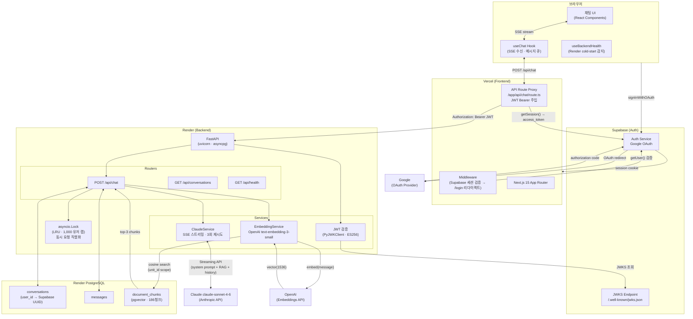
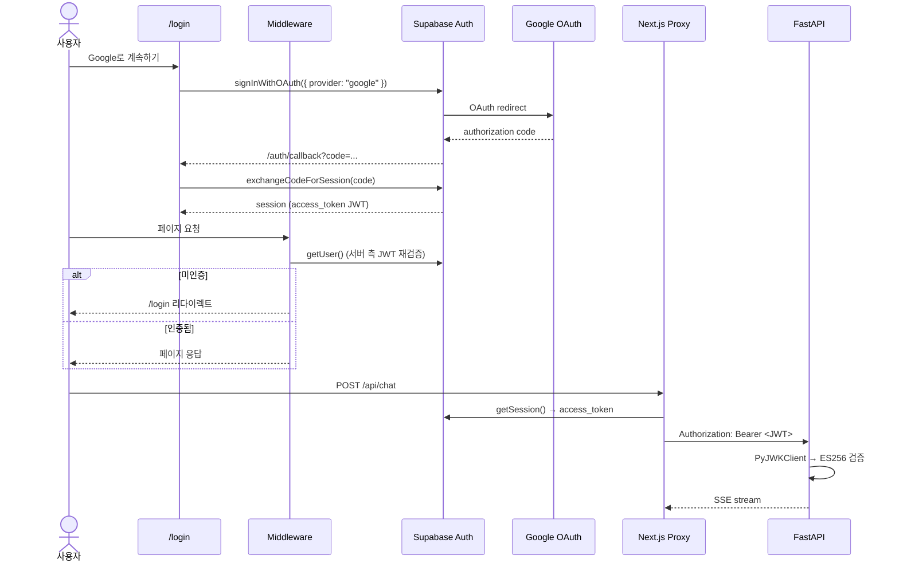
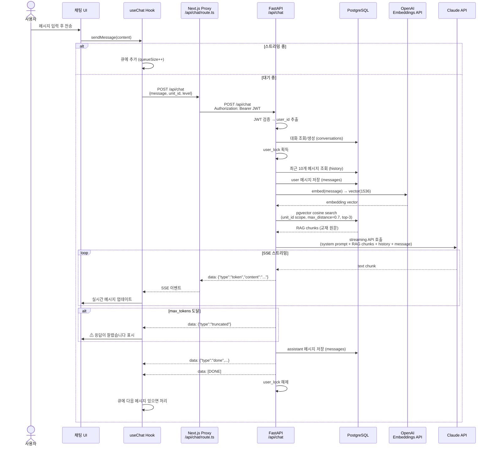
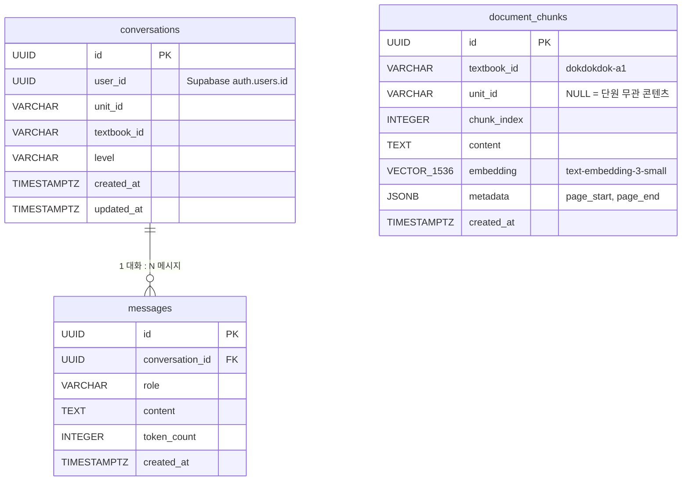

# LinguaRAG

독독독 A1 독일어 교재 기반 AI 튜터 앱. Google 계정으로 로그인한 뒤 단원을 선택하면 Claude가 해당 단원의 문법과 어휘를 실시간 스트리밍으로 설명합니다.

## 아키텍처

### 전체 시스템 구성



### 인증 흐름



### SSE 채팅 요청 흐름



### DB 스키마



## 기술 스택

| 레이어 | 기술 |
|--------|------|
| Frontend | Next.js 15, React 19, TypeScript, Tailwind CSS |
| Auth | Supabase Auth (Google OAuth, JWT ES256) |
| Backend | FastAPI, Python 3.11, asyncpg |
| AI | Claude claude-sonnet-4-6 (Anthropic SSE Streaming) |
| RAG | OpenAI `text-embedding-3-small` + pgvector (cosine 유사도 검색) |
| DB | PostgreSQL (pgcrypto, pgvector, asyncpg) |
| Deploy | Vercel (Frontend) + Render (Backend + DB) |

## 유저 플로우

```
/login  →  Google OAuth  →  /  (레벨 선택)  →  /setup  (단원 선택)  →  /chat
```

- `/login` — Google 로그인, 미인증 시 모든 경로에서 리다이렉트
- `/` — A1 / A2 레벨 선택 (재방문 시 마지막 단원으로 바로 이동)
- `/setup` — 독독독 교재 단원 선택 (Band 탭 + 라디오 리스트)
- `/chat` — 단원별 대화 패널, 사이드바 단원 전환, TTS 발음 재생

## 프로젝트 구조

```
lingua-rag/
├── backend/
│   ├── app/
│   │   ├── core/          # config (Settings), constants
│   │   ├── data/          # 독독독 A1 56개 단원 데이터, 시스템 프롬프트
│   │   ├── db/            # asyncpg 커넥션 풀, 레포지토리
│   │   ├── deps/          # auth.py — Supabase JWKS JWT 검증
│   │   ├── models/        # Pydantic v2 스키마
│   │   ├── routers/       # chat, conversations, health 엔드포인트
│   │   ├── services/      # ClaudeService (SSE), EmbeddingService (OpenAI)
│   │   └── main.py        # FastAPI 앱, CORS, lifespan
│   ├── scripts/
│   │   └── index_pdf.py   # PDF → 청크 → OpenAI 임베딩 → Supabase 인덱싱
│   ├── schema.sql          # DB 초기화 스크립트 (conversations, messages, document_chunks)
│   ├── requirements.txt
│   ├── Dockerfile          # Render 배포용
│   └── .env.example
└── frontend/
    ├── app/
    │   ├── api/            # Next.js → FastAPI 프록시 (JWT 주입)
    │   │   ├── chat/       # POST — SSE 스트림 프록시
    │   │   ├── conversations/  # GET — 대화 목록/메시지
    │   │   └── health/     # GET — Render cold-start 폴링
    │   ├── auth/callback/  # Supabase OAuth 콜백 처리
    │   ├── login/          # Google 로그인 페이지
    │   ├── setup/          # 교재 단원 선택 페이지
    │   ├── chat/           # 메인 채팅 페이지 (사이드바 + ChatPanel)
    │   └── page.tsx        # 레벨 선택 (Home)
    ├── components/         # ChatPanel, MessageList, InputBar
    ├── hooks/
    │   ├── useChat.ts      # SSE 스트리밍, 메시지 큐
    │   ├── useBackendHealth.ts  # Render cold-start 감지
    │   └── useTTS.ts       # Web Speech API (독일어 발음)
    ├── lib/
    │   ├── supabase/       # client.ts, server.ts (SSR)
    │   └── types.ts        # Message, Unit 타입, UNITS 데이터
    ├── middleware.ts        # Supabase 세션 검증 → 미인증 시 /login
    └── .env.example
```

## SSE 이벤트 포맷

```
data: {"type": "token",     "content": "..."}   # 스트리밍 청크
data: {"type": "truncated"}                       # max_tokens 도달
data: {"type": "done",      "conversation_id": "...", "message_id": "..."}
data: {"type": "error",     "message": "..."}
data: [DONE]                                      # 스트림 종료
```

## 로컬 개발

### 사전 준비

- Python 3.11+
- Node.js 20+
- PostgreSQL (로컬 또는 Render)
- Anthropic API 키
- Supabase 프로젝트 (Google OAuth 활성화)

### Backend

```bash
cd backend
python -m venv .venv && source .venv/bin/activate
pip install -r requirements.txt

cp .env.example .env
# .env에서 ANTHROPIC_API_KEY, DATABASE_URL, SUPABASE_URL 입력

# DB 스키마 초기화
psql $DATABASE_URL -f schema.sql

uvicorn app.main:app --reload --port 8000
```

### Frontend

```bash
cd frontend
npm install

cp .env.example .env.local
# .env.local에서 BACKEND_URL, NEXT_PUBLIC_SUPABASE_URL, NEXT_PUBLIC_SUPABASE_ANON_KEY 입력

npm run dev
# http://localhost:3000
```

## 환경 변수

### Backend (`backend/.env`)

| 변수 | 필수 | 설명 |
|------|------|------|
| `ANTHROPIC_API_KEY` | ✅ | Anthropic API 키 |
| `DATABASE_URL` | ✅ | PostgreSQL 연결 URL |
| `SUPABASE_URL` | ✅ | Supabase 프로젝트 URL (JWKS JWT 검증용) |
| `FRONTEND_URL` | ✅ | CORS 허용 오리진 (쉼표 구분) |
| `OPENAI_API_KEY` | ✅ | OpenAI API 키 (RAG 쿼리 임베딩용) |
| `ENVIRONMENT` | - | `development` / `production` (기본값: `development`) |
| `CLAUDE_MODEL` | - | 기본값: `claude-sonnet-4-6` |

`FRONTEND_URL`에 Vercel 프리뷰 URL을 허용하려면:
```
FRONTEND_URL=https://my-app.vercel.app,https://*.vercel.app
```

### Frontend (`frontend/.env.local`)

| 변수 | 필수 | 설명 |
|------|------|------|
| `BACKEND_URL` | ✅ | FastAPI 백엔드 URL |
| `NEXT_PUBLIC_SUPABASE_URL` | ✅ | Supabase 프로젝트 URL |
| `NEXT_PUBLIC_SUPABASE_ANON_KEY` | ✅ | Supabase anon (public) API 키 |

## 배포

### Supabase (Auth)

1. [supabase.com](https://supabase.com)에서 새 프로젝트 생성
2. **Authentication → Providers → Google** 활성화
   - Google Cloud Console에서 OAuth 클라이언트 ID/Secret 발급
   - Authorized redirect URI: `https://<project>.supabase.co/auth/v1/callback`
3. **Project Settings → API**에서 `URL`과 `anon` 키 확인

### Render (Backend)

1. Render에서 **Web Service** 생성 → GitHub `JayKim88/lingua-rag` 연결
2. Root Directory: `backend`, Runtime: **Docker**
3. **PostgreSQL** 추가 (Free 티어) → Internal Database URL 복사
4. 환경 변수 설정:
   - `DATABASE_URL` = PostgreSQL Internal URL
   - `ANTHROPIC_API_KEY` = Anthropic API 키
   - `OPENAI_API_KEY` = OpenAI API 키 (RAG 임베딩)
   - `SUPABASE_URL` = Supabase 프로젝트 URL
   - `FRONTEND_URL` = Vercel 배포 URL
   - `ENVIRONMENT` = `production`
5. PostgreSQL Shell에서 `schema.sql` 실행 (`vector` 익스텐션 포함)
6. PDF 인덱싱 실행 (최초 1회):
   ```bash
   python scripts/index_pdf.py --textbook dokdokdok-a1 --pdf <PDF_PATH> --clear
   ```

### Vercel (Frontend)

1. Vercel에서 새 프로젝트 → GitHub 리포 연결
2. Root Directory: `frontend`
3. 환경 변수 설정:
   - `BACKEND_URL` = Render 백엔드 URL
   - `NEXT_PUBLIC_SUPABASE_URL` = Supabase URL
   - `NEXT_PUBLIC_SUPABASE_ANON_KEY` = Supabase anon 키
4. Supabase **Authentication → URL Configuration**에서 추가:
   - Site URL: `https://your-app.vercel.app`
   - Redirect URLs: `https://your-app.vercel.app/auth/callback`

## API 엔드포인트

모든 엔드포인트는 `Authorization: Bearer <Supabase JWT>` 헤더 필요.

| Method | Path | 설명 |
|--------|------|------|
| `POST` | `/api/chat` | SSE 스트리밍 Q&A |
| `GET` | `/api/conversations` | 현재 유저의 대화 목록 |
| `GET` | `/api/conversations/{id}/messages` | 대화 메시지 조회 |
| `GET` | `/api/health` | 헬스 체크 (DB 연결 포함) |

## 설계 결정

**인증**: Supabase Google OAuth + JWT Bearer. httponly 쿠키 기반 익명 세션에서 전환. JWT는 Next.js API Route에서만 백엔드에 전달 — 브라우저가 FastAPI를 직접 호출하지 않음.

**JWT 검증**: FastAPI가 Supabase JWKS 엔드포인트(`/auth/v1/.well-known/jwks.json`)에서 공개키를 가져와 ES256으로 검증. `PyJWKClient`의 `lru_cache`로 JWKS 응답 캐싱.

**단원별 대화 격리**: `(user_id, unit_id)` 조합으로 대화를 분리. 단원 전환 시 새 대화 시작.

**동시성 제어**: 같은 유저의 중복 요청을 `asyncio.Lock` (LRU OrderedDict, 1,000 유저 캡)으로 직렬화. `--workers 1` 단일 프로세스 필수 (asyncio.Lock은 프로세스 간 공유 불가).

**고아 메시지 정리**: 앱 시작 시 1시간 이상 된 사용자 메시지 중 어시스턴트 응답이 없는 것을 삭제. 미드스트림 크래시로 발생하는 불완전한 대화 이력 방지.

**RAG 파이프라인**: 사용자 메시지를 `text-embedding-3-small`로 임베딩 → pgvector cosine 유사도 검색 (max_distance=0.7, top-3) → 매칭된 교재 원문을 Claude 시스템 프롬프트에 `## 교재 원문 참고`로 주입. 단원이 선택된 경우 해당 unit_id로 검색 범위를 제한. PDF 인덱싱은 `scripts/index_pdf.py`로 오프라인 실행 (독독독 A1: 186청크, 56단원).

**Render cold-start**: `useBackendHealth` 훅이 `/api/health`를 폴링(3초 간격, 최대 20회). 서버 준비 중이면 채팅 화면 상단에 경고 배너 표시.

**채팅 패널 지속성**: 단원 전환 시 기존 패널을 unmount하지 않고 `display: none`으로 숨김. 단원 재선택 시 대화 이력이 즉시 복원됨.

**Next.js 프록시**: 브라우저에서 FastAPI 백엔드를 직접 호출하지 않고 `app/api/chat/route.ts`를 통해 프록시. Supabase access token을 서버 사이드에서 주입해 Bearer 헤더로 전달.
