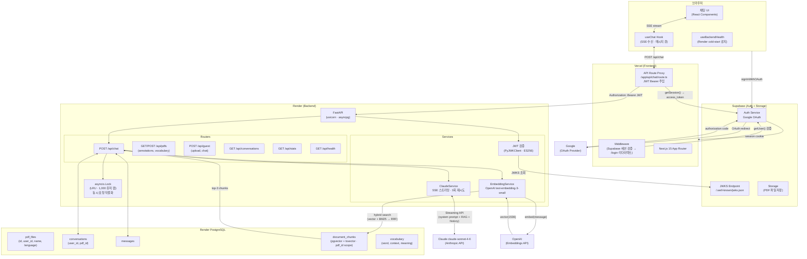
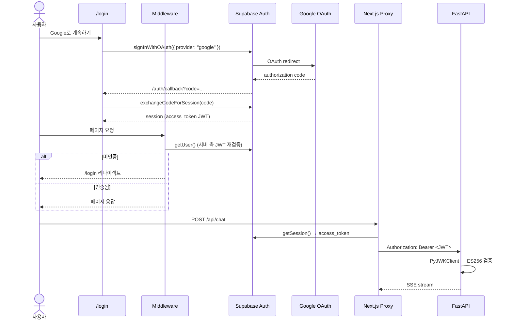
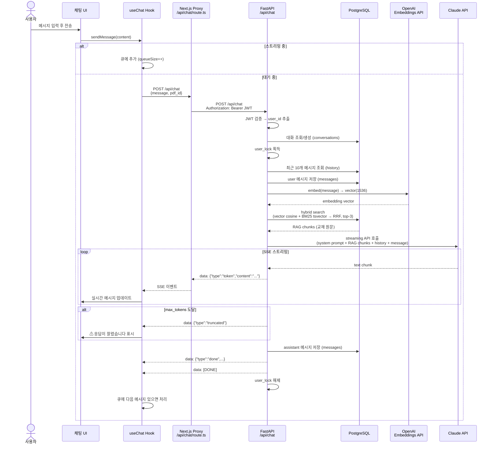
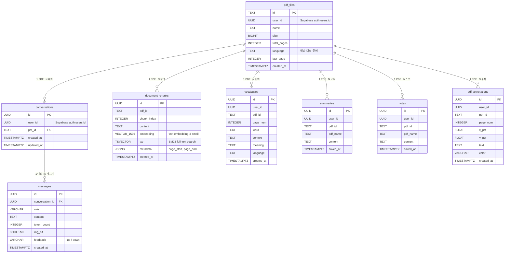

# LinguaRAG

유저가 자신의 언어 교재 PDF를 업로드하면, AI가 해당 교재 내용을 기반으로 학습을 도와주는 범용 AI 튜터 앱. Google 계정으로 로그인한 뒤 PDF를 선택하면 Claude가 RAG 기반으로 문법과 어휘를 실시간 스트리밍으로 설명합니다.

## 주요 기능

### AI 튜터 채팅
- **RAG 기반 Q&A** — 업로드한 PDF 교재 내용을 근거로 답변 (하이브리드 검색: pgvector cosine + BM25 tsvector → RRF 융합)
- **실시간 스트리밍** — Claude SSE 스트리밍으로 토큰 단위 실시간 응답
- **페이지 컨텍스트** — "이 페이지" 키워드 감지 시 현재 보고 있는 페이지 텍스트를 자동 전달
- **대화 이력 유지** — PDF별로 대화 스레드 분리, 최근 10개 메시지 히스토리 주입
- **학습 요약** — 대화 내용을 어휘/문법/핵심 문장으로 자동 정리
- **메시지 피드백** — 👍/👎 평가로 응답 품질 추적
- **재시도** — 특정 메시지부터 다시 질문 (이후 메시지 DB에서 삭제)

### PDF 뷰어
- **서버 기반 PDF 관리** — Supabase Storage 업로드/다운로드, 메타데이터 DB 저장
- **주석 (Sticky Notes)** — 페이지 위 클릭으로 메모 추가, 드래그 이동, 색상 변경
- **마지막 페이지 기억** — PDF 재진입 시 마지막으로 본 페이지에서 이어보기
- **텍스트 선택 팝업** — PDF 텍스트 드래그 시 액션 팝업 (소리, 복사, 번역, 질문하기, 단어장, 메모, 연습)

### 단어장
- **단어 추가** — 텍스트 선택 팝업에서 "단어장" 클릭으로 즉시 추가
- **단어장 패널** — PDF별 단어 목록, 페이지별 필터링, TTS 발음 재생
- **중복 감지** — 이미 등록된 단어 추가 시 경고 + 기존 단어로 이동 옵션
- **단어 플래시** — 단어장 항목 클릭 시 PDF 해당 위치 빨간색 깜빡임

### 다국어 지원
- **범용 언어 튜터** — PDF별로 학습 언어 설정 (독일어, 영어, 일본어 등 제한 없음)
- **TTS 발음 재생** — Web Speech API 기반 다국어 발음, 단어/문장 선택 재생
- **발음 모달** — 선택한 텍스트의 발음을 반복 청취
- **인라인 번역** — MyMemory API 기반 선택 텍스트 한국어 번역

### 학습 관리
- **노트 패널** — PDF 페이지별 메모 슬라이드 패널, 전체/페이지 필터
- **응답 저장** — 채팅 응답의 북마크 버튼으로 노트 또는 페이지에 저장
- **요약 저장 모달** — 탭 UI로 "현재 페이지 노트에 저장" / "페이지에 저장" 선택
- **폴더/페이지 트리** — 사이드바에서 폴더 생성, 드래그앤드롭 정렬, 페이지 뷰어
- **PDF 사이드바** — 업로드한 PDF 목록 + 컨텍스트 메뉴 (이름 변경, 삭제)
- **사용 통계** — 메시지 수, 토큰 사용량, RAG 적중률, 비용 추정 (`/api/stats`)

### 인증 및 보안
- **Google OAuth** — Supabase Auth 기반 소셜 로그인
- **JWT 프록시** — 브라우저 → Next.js API Route → FastAPI, JWT는 서버 사이드에서만 전달
- **게스트 모드** — 비로그인 PDF 업로드 (100페이지, IP당 3회/일) + 채팅 (대화 비저장)

## 아키텍처

### 전체 시스템 구성



### 인증 흐름



### SSE 채팅 요청 흐름



### DB 스키마



## 기술 스택

| 레이어 | 기술 |
|--------|------|
| Frontend | Next.js 15, React 19, TypeScript, Tailwind CSS |
| Auth | Supabase Auth (Google OAuth, JWT ES256) |
| Backend | FastAPI, Python 3.13, asyncpg |
| AI | Claude claude-sonnet-4-6 (Anthropic SSE Streaming) |
| RAG | OpenAI `text-embedding-3-small` + pgvector cosine + BM25 tsvector → RRF 하이브리드 검색 |
| DB | PostgreSQL (pgcrypto, pgvector, asyncpg) |
| Storage | Supabase Storage (PDF 파일) |
| Deploy | Vercel (Frontend) + Render (Backend + DB) |

## 유저 플로우

```
게스트:  /chat  →  PDF 업로드 (100p, 3회/일)  →  채팅 (대화 비저장)
회원:    /login  →  Google OAuth  →  /chat  →  전체 기능
```

- `/login` — Google 로그인, 미인증 시 게스트 모드로 제한적 이용
- `/chat` — PDF 사이드바 + PDF 뷰어 + 채팅 패널, TTS/번역, 주석/단어장/노트 관리

## 프로젝트 구조

```
lingua-rag/
├── backend/
│   ├── app/
│   │   ├── core/          # config (Settings), storage (Supabase Storage 클라이언트)
│   │   ├── data/          # 범용 시스템 프롬프트 빌더
│   │   ├── db/            # asyncpg 커넥션 풀, 레포지토리
│   │   ├── deps/          # auth.py — Supabase JWKS JWT 검증
│   │   ├── models/        # Pydantic v2 스키마
│   │   ├── routers/       # chat, conversations, pdfs, summaries, notes, guest, stats 엔드포인트
│   │   ├── services/      # ClaudeService (SSE), EmbeddingService (OpenAI)
│   │   └── main.py        # FastAPI 앱, CORS, lifespan
│   ├── migrations/        # DB 마이그레이션 SQL
│   ├── scripts/           # 오프라인 PDF 인덱싱 스크립트
│   ├── tests/             # pytest 테스트
│   ├── requirements.txt
│   ├── Dockerfile         # Render 배포용
│   └── .env.example
└── frontend/
    ├── app/
    │   ├── api/            # Next.js → FastAPI 프록시 (JWT 주입)
    │   │   ├── chat/       # POST — SSE 스트림 프록시
    │   │   ├── conversations/  # GET — 대화 목록/메시지
    │   │   ├── pdfs/       # PDF 업로드/목록/주석/단어장/언어 설정
    │   │   ├── summaries/  # 학습 요약 CRUD
    │   │   ├── notes/      # 노트 CRUD
    │   │   ├── guest/      # 게스트 PDF 업로드/채팅
    │   │   └── health/     # GET — Render cold-start 폴링
    │   ├── auth/callback/  # Supabase OAuth 콜백 처리
    │   ├── login/          # Google 로그인 페이지
    │   ├── chat/           # 메인 채팅 페이지 (사이드바 + PDF 뷰어 + ChatPanel)
    │   └── page.tsx        # → /chat 리다이렉트
    ├── components/         # ChatPanel, MessageList, PdfViewer, InputBar, NoteSlidePanel,
    │                       # SidebarTree, PageViewer, SummarySaveModal, PronunciationModal
    ├── hooks/
    │   ├── useChat.ts      # SSE 스트리밍, 메시지 큐
    │   ├── useBackendHealth.ts  # Render cold-start 감지
    │   └── useTTS.ts       # Web Speech API (다국어 발음)
    ├── lib/
    │   ├── supabase/       # client.ts, server.ts (SSR)
    │   ├── types.ts        # Message, SavedSummary, SavedNote, VocabEntry 타입
    │   ├── pdfLibrary.ts   # PDF 업로드/목록 관리
    │   ├── annotations.ts  # PDF 주석/단어장 CRUD
    │   ├── summaries.ts    # 학습 요약 API
    │   ├── notes.ts        # 노트 API
    │   └── tree.ts         # 폴더/페이지 트리 (localStorage)
    ├── middleware.ts        # Supabase 세션 검증 → 미인증 시 /login
    └── .env.example
```

## SSE 이벤트 포맷

```
data: {"type": "token",     "content": "..."}   # 스트리밍 청크
data: {"type": "truncated"}                       # max_tokens 도달
data: {"type": "usage",     "output_tokens": N, "input_tokens": N, ...}
data: {"type": "done",      "conversation_id": "...", "message_id": "..."}
data: {"type": "error",     "message": "..."}
data: [DONE]                                      # 스트림 종료
```

## 로컬 개발

### 사전 준비

- Python 3.13+
- Node.js 20+
- PostgreSQL (로컬 또는 Render)
- Anthropic API 키
- OpenAI API 키 (RAG 임베딩)
- Supabase 프로젝트 (Google OAuth + Storage 활성화)

### Backend

```bash
cd backend
python -m venv .venv && source .venv/bin/activate
pip install -r requirements.txt

cp .env.example .env
# .env에서 ANTHROPIC_API_KEY, DATABASE_URL, SUPABASE_URL, OPENAI_API_KEY 입력

# DB 스키마 초기화
psql $DATABASE_URL -f schema.sql

uvicorn app.main:app --reload --port 8000
```

### Frontend

```bash
cd frontend
npm install

cp .env.example .env.local
# .env.local에서 BACKEND_URL, NEXT_PUBLIC_SUPABASE_URL, NEXT_PUBLIC_SUPABASE_ANON_KEY 입력

npm run dev
# http://localhost:3000
```

## 환경 변수

### Backend (`backend/.env`)

| 변수 | 필수 | 설명 |
|------|------|------|
| `ANTHROPIC_API_KEY` | O | Anthropic API 키 |
| `DATABASE_URL` | O | PostgreSQL 연결 URL |
| `SUPABASE_URL` | O | Supabase 프로젝트 URL (JWKS JWT 검증용) |
| `SUPABASE_SERVICE_KEY` | O | Supabase service role 키 (Storage 접근) |
| `FRONTEND_URL` | O | CORS 허용 오리진 (쉼표 구분) |
| `OPENAI_API_KEY` | O | OpenAI API 키 (RAG 쿼리 임베딩용) |
| `ENVIRONMENT` | - | `development` / `production` (기본값: `development`) |
| `CLAUDE_MODEL` | - | 기본값: `claude-sonnet-4-6` |
| `RAG_ENABLED` | - | RAG 검색 활성화 (기본값: `true`) |

### Frontend (`frontend/.env.local`)

| 변수 | 필수 | 설명 |
|------|------|------|
| `BACKEND_URL` | O | FastAPI 백엔드 URL |
| `NEXT_PUBLIC_SUPABASE_URL` | O | Supabase 프로젝트 URL |
| `NEXT_PUBLIC_SUPABASE_ANON_KEY` | O | Supabase anon (public) API 키 |

## 배포

### Supabase (Auth + Storage)

1. [supabase.com](https://supabase.com)에서 새 프로젝트 생성
2. **Authentication > Providers > Google** 활성화
   - Google Cloud Console에서 OAuth 클라이언트 ID/Secret 발급
   - Authorized redirect URI: `https://<project>.supabase.co/auth/v1/callback`
3. **Storage** — PDF 저장용 버킷 생성
4. **Project Settings > API**에서 `URL`, `anon` 키, `service_role` 키 확인

### Render (Backend)

1. Render에서 **Web Service** 생성 → GitHub `JayKim88/lingua-rag` 연결
2. Root Directory: `backend`, Runtime: **Docker**
3. **PostgreSQL** 추가 (Free 티어) → Internal Database URL 복사
4. 환경 변수 설정:
   - `DATABASE_URL` = PostgreSQL Internal URL
   - `ANTHROPIC_API_KEY` = Anthropic API 키
   - `OPENAI_API_KEY` = OpenAI API 키 (RAG 임베딩)
   - `SUPABASE_URL` = Supabase 프로젝트 URL
   - `SUPABASE_SERVICE_KEY` = Supabase service role 키
   - `FRONTEND_URL` = Vercel 배포 URL
   - `ENVIRONMENT` = `production`
5. PostgreSQL Shell에서 `schema.sql` 실행 (`vector` 익스텐션 포함)

### Vercel (Frontend)

1. Vercel에서 새 프로젝트 → GitHub 리포 연결
2. Root Directory: `frontend`
3. 환경 변수 설정:
   - `BACKEND_URL` = Render 백엔드 URL
   - `NEXT_PUBLIC_SUPABASE_URL` = Supabase URL
   - `NEXT_PUBLIC_SUPABASE_ANON_KEY` = Supabase anon 키
4. Supabase **Authentication > URL Configuration**에서 추가:
   - Site URL: `https://your-app.vercel.app`
   - Redirect URLs: `https://your-app.vercel.app/auth/callback`

## API 엔드포인트

인증 필요 (`Authorization: Bearer <Supabase JWT>`) 엔드포인트와 게스트 엔드포인트로 구분.

**인증 필요**

| Method | Path | 설명 |
|--------|------|------|
| `POST` | `/api/chat` | SSE 스트리밍 Q&A (하이브리드 RAG) |
| `GET` | `/api/conversations` | 현재 유저의 대화 목록 |
| `GET` | `/api/conversations/{id}/messages` | 대화 메시지 조회 |
| `GET/POST` | `/api/pdfs` | PDF 목록 조회 / 업로드 |
| `GET/DELETE` | `/api/pdfs/{id}` | PDF 조회 / 삭제 |
| `GET/POST/PUT/DELETE` | `/api/pdfs/{id}/annotations` | PDF 주석 CRUD |
| `GET/POST` | `/api/pdfs/{id}/vocabulary` | 단어장 목록 / 추가 |
| `PATCH/DELETE` | `/api/pdfs/{id}/vocabulary/{vocabId}` | 단어 수정 / 삭제 |
| `PATCH` | `/api/pdfs/{id}/language` | PDF 학습 언어 설정 |
| `GET/PATCH` | `/api/pdfs/{id}/last-page` | 마지막 읽은 페이지 |
| `GET/POST` | `/api/summaries` | 학습 요약 목록 / 저장 |
| `DELETE` | `/api/summaries/{id}` | 학습 요약 삭제 |
| `GET/POST` | `/api/notes` | 노트 목록 / 저장 |
| `DELETE` | `/api/notes/{id}` | 노트 삭제 |
| `PATCH` | `/api/messages/{id}/feedback` | 메시지 피드백 (up/down) |
| `DELETE` | `/api/messages/{id}/truncate` | 메시지 이후 삭제 (재시도) |
| `GET` | `/api/stats` | 사용 통계 (메시지, 토큰, 비용 추정) |
| `GET` | `/api/health` | 헬스 체크 (DB 연결 포함) |

**게스트 (인증 불필요)**

| Method | Path | 설명 |
|--------|------|------|
| `POST` | `/api/guest/pdfs/upload` | 게스트 PDF 업로드 (100p, IP당 3회/일) |
| `POST` | `/api/guest/chat` | 게스트 SSE 채팅 (대화 비저장) |

## 설계 결정

**인증**: Supabase Google OAuth + JWT Bearer. Next.js API Route에서만 백엔드에 JWT 전달 — 브라우저가 FastAPI를 직접 호출하지 않음.

**JWT 검증**: FastAPI가 Supabase JWKS 엔드포인트에서 공개키를 가져와 ES256으로 검증. `PyJWKClient`의 `lru_cache`로 JWKS 응답 캐싱.

**PDF별 대화 격리**: `(user_id, pdf_id)` 조합으로 대화를 분리. PDF 전환 시 해당 PDF의 대화 이력 로드.

**범용 언어 튜터**: 시스템 프롬프트가 `language` 파라미터를 받아 어떤 언어든 지원. PDF별로 학습 언어를 설정할 수 있으며, RAG 컨텍스트가 없으면 일반 지식으로 답변.

**Prompt Caching**: 시스템 프롬프트를 고정 prefix (튜터 역할 + 답변 규칙)와 동적 suffix (RAG 결과)로 분리. 고정 부분에 `cache_control: ephemeral`을 적용해 Anthropic prompt caching 활용.

**동시성 제어**: 같은 유저의 중복 요청을 `asyncio.Lock` (LRU OrderedDict, 1,000 유저 캡)으로 직렬화.

**하이브리드 RAG 파이프라인**: 사용자 메시지를 `text-embedding-3-small`로 임베딩 → (1) pgvector cosine 유사도 검색 + (2) BM25 tsvector 키워드 검색 → Reciprocal Rank Fusion (K=60)으로 두 결과 융합 → top-3 청크를 Claude 시스템 프롬프트에 주입. `pdf_id`로 검색 범위 제한. 하이브리드 검색 실패 시 vector-only fallback.

**게스트 모드**: sentinel `user_id`(`00000000-...`)로 게스트 데이터 격리. IP 기반 rate limit (3 업로드/일, 100페이지 제한). 채팅 응답은 스트리밍되지만 DB에 저장하지 않음.

**PDF 저장**: Supabase Storage에 저장. 메타데이터(이름, 크기, 페이지 수, 언어)는 PostgreSQL `pdf_files` 테이블에 관리.

**Render cold-start**: `useBackendHealth` 훅이 `/api/health`를 폴링(3초 간격, 최대 20회). 서버 준비 중이면 채팅 화면 상단에 경고 배너 표시.
