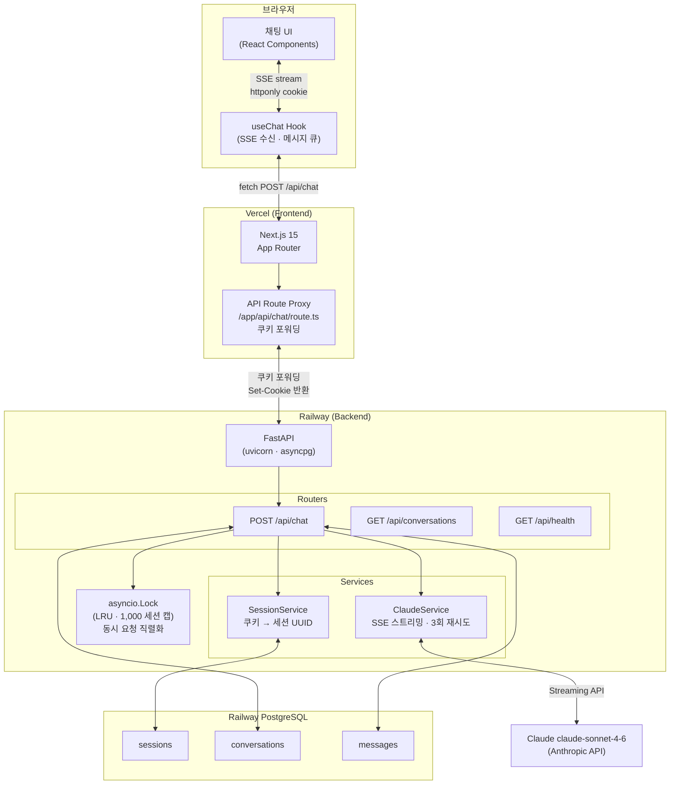
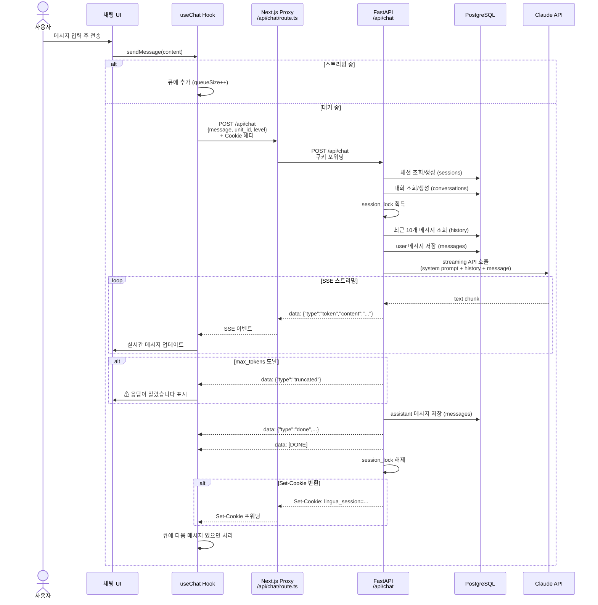
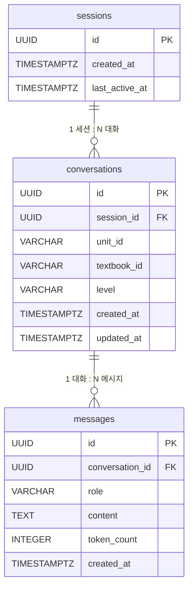

# LinguaRAG

독독독 A1 독일어 교재 기반 AI 튜터 앱. 단원을 선택하면 Claude가 해당 단원의 문법과 어휘를 실시간 스트리밍으로 설명합니다.

## 아키텍처

### 시스템 구성



### SSE 채팅 요청 흐름



### DB 스키마



## 기술 스택

| 레이어 | 기술 |
|--------|------|
| Frontend | Next.js 15, React 19, TypeScript, Tailwind CSS |
| Backend | FastAPI, Python 3.11, asyncpg |
| AI | Claude claude-sonnet-4-6 (Anthropic SSE Streaming) |
| DB | PostgreSQL (pgcrypto, asyncpg) |
| Deploy | Vercel (Frontend) + Railway (Backend + DB) |

## 프로젝트 구조

```
lingua-rag/
├── backend/
│   ├── app/
│   │   ├── core/          # config, constants
│   │   ├── data/          # 독독독 A1 56개 단원 데이터, 시스템 프롬프트
│   │   ├── db/            # asyncpg 커넥션 풀, 레포지토리
│   │   ├── models/        # Pydantic v2 스키마
│   │   ├── routers/       # chat, conversations, health 엔드포인트
│   │   ├── services/      # ClaudeService (SSE), SessionService
│   │   └── main.py        # FastAPI 앱, CORS, lifespan
│   ├── schema.sql          # DB 초기화 스크립트
│   ├── requirements.txt
│   ├── Dockerfile          # Railway 배포용
│   └── .env.example
└── frontend/
    ├── app/               # Next.js App Router
    │   └── api/chat/      # Next.js → FastAPI 프록시 (쿠키 포워딩)
    ├── components/        # ChatPanel, MessageList, InputBar
    ├── hooks/             # useChat (SSE 스트리밍, 메시지 큐)
    ├── lib/               # types, API 클라이언트
    └── .env.example
```

## SSE 이벤트 포맷

```
data: {"type": "token",     "content": "..."}   # 스트리밍 청크
data: {"type": "truncated"}                       # max_tokens 도달
data: {"type": "done",      "conversation_id": "...", "message_id": "..."}
data: {"type": "error",     "message": "..."}
data: [DONE]                                      # 스트림 종료
```

## 로컬 개발

### 사전 준비

- Python 3.11+
- Node.js 20+
- PostgreSQL (로컬 또는 Railway)
- Anthropic API 키

### Backend

```bash
cd backend
python -m venv .venv && source .venv/bin/activate
pip install -r requirements.txt

cp .env.example .env
# .env에서 ANTHROPIC_API_KEY, DATABASE_URL 입력

# DB 스키마 초기화
psql $DATABASE_URL -f schema.sql

uvicorn app.main:app --reload --port 8000
```

### Frontend

```bash
cd frontend
npm install

cp .env.example .env.local
# .env.local에서 BACKEND_URL 확인 (기본값: http://localhost:8000)

npm run dev
# http://localhost:3000
```

## 환경 변수

### Backend (`backend/.env`)

| 변수 | 필수 | 설명 |
|------|------|------|
| `ANTHROPIC_API_KEY` | ✅ | Anthropic API 키 |
| `DATABASE_URL` | ✅ | PostgreSQL 연결 URL |
| `FRONTEND_URL` | ✅ | CORS 허용 오리진 (쉼표 구분) |
| `ENVIRONMENT` | - | `development` / `production` (기본값: `development`) |
| `CLAUDE_MODEL` | - | 기본값: `claude-sonnet-4-6` |

`FRONTEND_URL`에 Vercel 프리뷰 URL을 허용하려면:
```
FRONTEND_URL=https://my-app.vercel.app,https://*.vercel.app
```

### Frontend (`frontend/.env.local`)

| 변수 | 필수 | 설명 |
|------|------|------|
| `BACKEND_URL` | ✅ | FastAPI 백엔드 URL |

## 배포

### Railway (Backend)

1. Railway에서 새 프로젝트 생성 → GitHub 리포 연결
2. PostgreSQL 플러그인 추가 → `DATABASE_URL` 자동 주입
3. 환경 변수 설정: `ANTHROPIC_API_KEY`, `FRONTEND_URL`
4. `backend/schema.sql`을 Railway DB에 실행

### Vercel (Frontend)

1. Vercel에서 새 프로젝트 → GitHub 리포 연결
2. Root Directory: `frontend`
3. 환경 변수: `BACKEND_URL=<Railway 백엔드 URL>`

## API 엔드포인트

| Method | Path | 설명 |
|--------|------|------|
| `POST` | `/api/chat` | SSE 스트리밍 Q&A |
| `GET` | `/api/conversations` | 현재 세션의 대화 목록 |
| `GET` | `/api/conversations/{id}/messages` | 대화 메시지 조회 |
| `GET` | `/api/health` | 헬스 체크 (DB 연결 포함) |

## 설계 결정

**세션 관리**: httponly 쿠키 기반 익명 세션. 로그인 없이 대화 이력 유지.

**단원별 대화 격리**: `(session_id, unit_id)` 조합으로 대화를 분리. 단원 전환 시 새 대화 시작.

**동시성 제어**: 같은 세션의 중복 요청을 `asyncio.Lock` (LRU OrderedDict, 1,000 세션 캡)으로 직렬화. `--workers 1` 단일 프로세스 필수 (asyncio.Lock은 프로세스 간 공유 불가).

**고아 메시지 정리**: 앱 시작 시 1시간 이상 된 사용자 메시지 중 어시스턴트 응답이 없는 것을 삭제. 미드스트림 크래시로 발생하는 불완전한 대화 이력 방지.

**Next.js 프록시**: 브라우저에서 FastAPI 백엔드를 직접 호출하지 않고 `app/api/chat/route.ts`를 통해 프록시. 세션 쿠키를 안전하게 포워딩.
